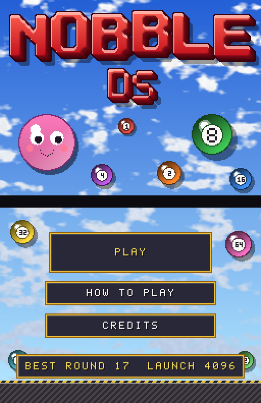
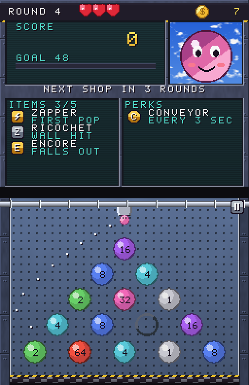
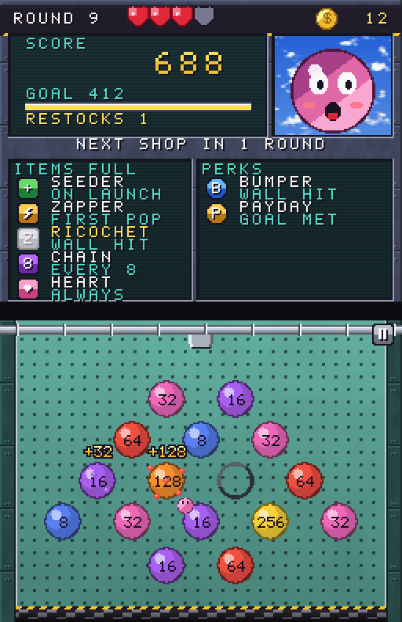
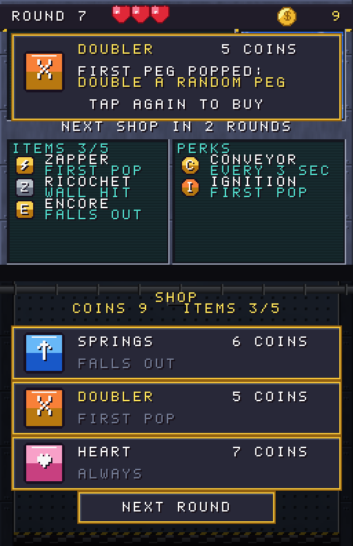
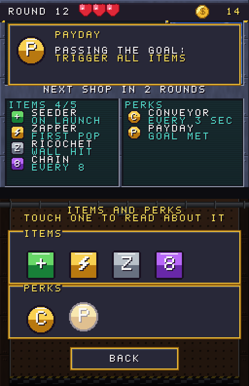
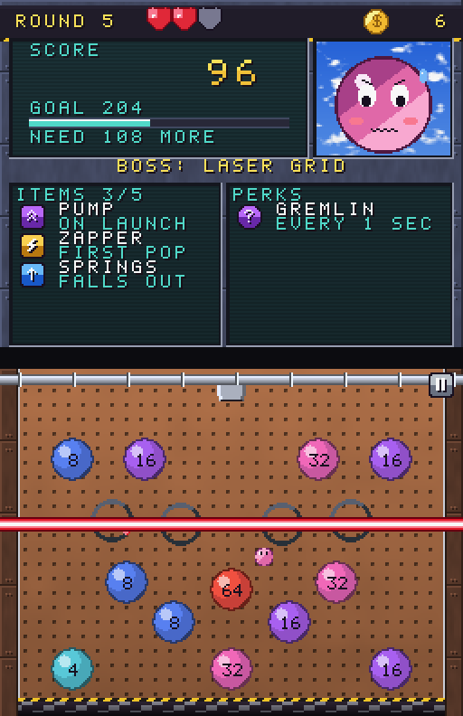
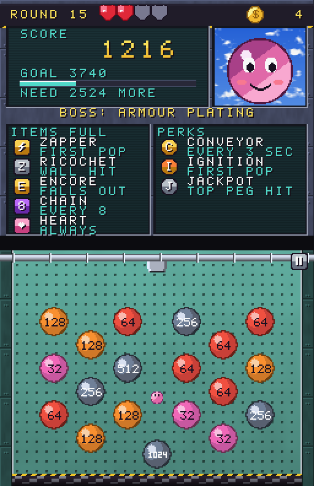
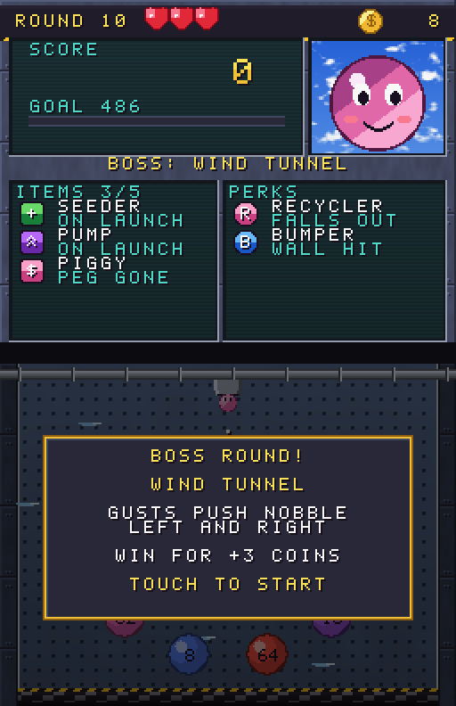

# Nobble DS



A number-popping roguelike for the Nintendo DS, loosely inspired by
*Nubby's Number Factory*. Drag on the touch screen to aim Nobble, let go to
launch it, bounce it off the walls and pop the numbered pegs to hit each
round's quota in a single launch.

This is the DS version of [Nobble GBA](https://github.com/hjcoggan/nobble-gba),
rebuilt to use the extra hardware:

- **Two screens.** The whole touch screen is the board, with 33 bigger pegs.
  The top screen is a dashboard: a big score counter with a bar filling towards
  the goal, lives, coins, your items and perks, and a Nobble face that reacts to
  what's happening.
- **Touch controls.** Drag to aim with a live guide line, let go to launch.
  The shop, perk choices and menus are all tap-to-pick. The d-pad and buttons
  still work everywhere.
- **Full-colour art.** Both screens use 32,768-colour pictures instead of
  256-colour tiles, with bigger sprites, pop sparks, floating score numbers and
  screen shake.
- **Stereo sound.** The music uses more channels, with a panned echo on the
  melody, a sampled bass and a punchier kick. Peg pops are panned to where the
  peg is.


| | |
| :---: | :---: |
|  |  |
| Drag to aim: the guide shows the path, bounces and all | Pops throw sparks and scores; the goal bar fills and Nobble cheers |
|  |  |
| Tap a card to read it on the top screen, again to buy | Every item and perk you own, one touch away |
|  |  |
| Laser Grid: the beam wipes out a band of pegs | Armour Plating: steel pegs need a hit before they score |
|  | |
| Every 5th round is a boss round | |

> **Made with AI:** this game was built with [Claude](https://claude.ai), Anthropic's
> AI model, using Claude Code. The code, artwork, music and documentation were
> written by Claude, directed and playtested by [@hjcoggan](https://github.com/hjcoggan).
> See [AI disclosure](#ai-disclosure) below.

## How to play

- **Touch and drag** anywhere on the board to aim the launcher, then **let go**
  to launch Nobble. The dotted line shows where it will go. (Or aim with
  **Left / Right**, nudge with **L / R** and launch with **A**.)
- Pegs hold powers of two. When Nobble hits a peg it **scores the peg's number
  and halves it**: 8 becomes 4, then 2, then 1, and a 1 pops and vanishes.
  Nobble bounces off pegs and the side walls until it falls into the shredder.
- Each round has a **quota**, a share of all the points left on the board.
  You must reach it **in a single launch**. Miss and you lose a life and the
  board resets for another try.
- Beat the quota and the board **restocks** once for every multiple of the
  quota you scored: pegs with the same number **merge in pairs** into one worth
  double, then empty slots fill with new pegs. Each restock pays a coin, and
  clearing a round restores a life. New pegs double in value every other
  round, so the numbers climb into the hundreds and thousands.
- The pegs sit in one of eight **layouts** (Classic, Diamond, Funnel, Columns,
  Ring, Pyramid, Zigzag, Scatter), 13 to 19 pegs each, with a new layout every
  3 rounds. Your biggest pegs move across to the new layout.
- Pop every peg on the board for a **perfect**: the launch scores double.
- Every 3 rounds there's a shop. You can hold up to **5 items**, and each
  one fires on its own trigger. With all 5, buying another lets you swap out
  one you already have, and you get half its price back:

| Item | Trigger | Effect | Cost |
| --- | --- | --- | --- |
| Springs | Nobble falls out | Bounce back up (once per launch) | 6 |
| Seeder | On launch | Add a peg to an empty slot | 4 |
| Pump | On launch | Double the lowest peg | 5 |
| Zapper | First peg popped | Pop the highest peg | 5 |
| Doubler | First peg popped | Double a random peg | 5 |
| Ricochet | Wall bounce | Pop a random peg (up to 6 a launch) | 6 |
| Piggy | Peg popped away | 1 in 4 chance of a coin | 4 |
| Encore | Nobble falls out | +25% of the launch score | 6 |
| Chain | Every 8 pegs popped | Double a random peg | 5 |
| Big | Always | Nobble is bigger | 6 |
| Heart | Always | +1 life and +1 to your maximum | 7 |

- Every 5 rounds you choose one of two **perks** (up to 4). Perks force items
  to fire, and an icon flashes whenever an item or perk goes off:

| Perk | When | What it triggers |
| --- | --- | --- |
| Conveyor | Every 3 seconds in flight | All items |
| Gremlin | Every second in flight | A random item |
| Ignition | First peg popped | 2 random items |
| Recycler | Nobble falls out | 50% chance: a random item |
| Bumper | Wall bounce | 1 in 4 chance: a random item |
| Payday | Passing the goal | All items |
| Jackpot | First pop is the biggest peg | 3 random items |
| Domino | 15 pegs popped | All items |

- Every 5th round is a **boss round** with a hazard on the board. Beat it for
  3 bonus coins:

| Boss | Hazard |
| --- | --- |
| Laser Grid | A laser locks onto a row, blinks a warning, then wipes it out |
| Wind Tunnel | Gusts push Nobble sideways, switching direction every 1.5 seconds |
| Armour Plating | Steel-grey pegs need one hit to crack the armour before they score |

- The music changes every 5 rounds (Factory Funk, Assembly Line, Overtime,
  Meltdown), and boss rounds have their own theme.

Tap the pause button in the top-right corner (or press **Start**) to pause.
**Items and perks** in the pause menu shows everything you own; touch one to
read about it on the top screen.

Your furthest round and best single launch are saved to `nobble-ds.sav` on the
SD card. That works on flash carts, and in melonDS with DLDI turned on
(Config → Emu settings → DLDI). Without an SD card the game still runs but
can't remember scores.

## Building from source

You need [devkitPro](https://devkitpro.org)'s DS toolchain (devkitARM and libnds), `make` and `git`.
Python 3 is only needed if you change the artwork (`make assets`).

### macOS

1. Download and run the devkitPro pacman installer (`.pkg`) from
   <https://github.com/devkitPro/pacman/releases>, then install the DS tools:

   ```bash
   sudo dkp-pacman -S nds-dev
   ```

2. Add the toolchain to your shell (append to `~/.zshrc`, then `source ~/.zshrc`):

   ```bash
   export DEVKITPRO=/opt/devkitpro
   export DEVKITARM=$DEVKITPRO/devkitARM
   export PATH=$DEVKITPRO/tools/bin:$DEVKITARM/bin:$PATH
   ```

3. Install melonDS from <https://melonds.kuribo64.net> (drag it into
   Applications; the first time, allow it under System Settings → Privacy &
   Security → Open Anyway).

4. Build and run:

   ```bash
   git clone https://github.com/hjcoggan/nobble-ds.git ~/nobble-ds
   cd ~/nobble-ds
   make
   open -a melonDS nobble-ds.nds
   ```

### Windows

1. Download the graphical installer (`devkitProUpdater`) from
   <https://github.com/devkitPro/installer/releases> and run it. When it asks
   which components to install, tick **NDS Development**. It installs to
   `C:\devkitPro` and sets the `DEVKITPRO`/`DEVKITARM` variables for you.

2. Open **MSYS2** from the devkitPro folder in the Start menu (a bash shell that
   comes with devkitPro, with `make` and `git`) and build:

   ```bash
   git clone https://github.com/hjcoggan/nobble-ds.git
   cd nobble-ds
   make
   ```

   If `git` is missing, install it with `pacman -S git`.

3. Install melonDS from <https://melonds.kuribo64.net> and open `nobble-ds.nds`
   with it (or drag the file onto the melonDS window).

### Linux

1. Install devkitPro pacman. On Debian, Ubuntu and derivatives:

   ```bash
   wget https://apt.devkitpro.org/install-devkitpro-pacman
   chmod +x ./install-devkitpro-pacman
   sudo ./install-devkitpro-pacman
   ```

   On Arch and other distros, follow
   <https://devkitpro.org/wiki/devkitPro_pacman>.

2. Install the DS tools, then log out and back in (or run
   `source /etc/profile.d/devkit-env.sh`) so the environment variables are set:

   ```bash
   sudo dkp-pacman -S nds-dev
   ```

   On Arch-based systems the command is `sudo pacman -S nds-dev` after adding
   the devkitPro repositories.

3. Install melonDS from Flathub with `flatpak install flathub net.kuribo64.melonDS`,
   or from <https://melonds.kuribo64.net>.

4. Build and run:

   ```bash
   git clone https://github.com/hjcoggan/nobble-ds.git
   cd nobble-ds
   make
   flatpak run net.kuribo64.melonDS nobble-ds.nds
   ```

### Tests

The physics and game rules have host-side tests that build with your normal C compiler:

```bash
make test
```

## Project layout

```
source/main.c     Game states, touch input, the dashboard, board sprites, shop, menus
source/game.c     Launch physics, popping pegs, quotas, restocks, items, perks, bosses
source/gfx.c      Both screens: full-colour pictures, text layers, panels, sprites, fades
source/sound.c    Music and sound effects on the DS's 16 sound channels
source/save.c     Best round and score in a file on the SD card
source/assets.c   Generated: palettes, sprite tiles, font
data/*.bin        Generated: the full-colour 256x192 screen pictures
tools/gen_assets.py  Draws all artwork and writes the files above, icon.bmp and
                     build/preview_*.png
tests/            Host-side tests for the game logic
```

The game uses libnds and libfat from devkitPro's `nds-dev`. After editing the
artwork in `tools/gen_assets.py`, run `make assets`.

## AI disclosure

Nearly everything in this repository was generated by Claude (Anthropic) in
Claude Code sessions: the C source, the build setup, the tests, the procedural
artwork generator, the music and sound effects, and this README. A human chose
the features, played the builds and reported what to change. Commits written
this way carry a `Co-Authored-By: Claude` trailer.

The code has host-side tests for the physics and game rules, but it has not
been reviewed line by line by a person, so expect rough edges. Bug reports and
pull requests are welcome.

## License

[MIT](LICENSE) - do whatever you like with it. All code, art and music in this
repo is original; the artwork is generated by `tools/gen_assets.py`.

This is an unofficial fan project inspired by *Nubby's Number Factory*. It is
not affiliated with or endorsed by MogDogBlog Productions.
