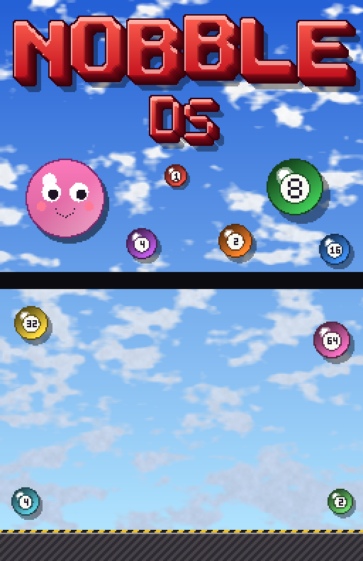
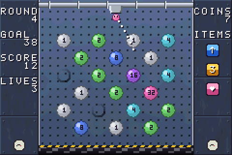

# Nubby GBA



A number-popping roguelike for the Game Boy Advance, loosely inspired by
*Nubby's Number Factory*. Aim Nubby from the launcher, bounce it off the walls
and pop the numbered pegs to hit each round's quota in a single launch.



> **Made with AI:** this game was built with [Claude](https://claude.ai), Anthropic's
> AI model, using Claude Code. The code, artwork, music and documentation were
> written by Claude, directed and playtested by [@hjcoggan](https://github.com/hjcoggan).
> See [AI disclosure](#ai-disclosure) below.

## How to play

- Aim the launcher at the top with **Left / Right** (L / R nudge one step) and
  press **A** to launch Nubby. The dotted line shows where it will go.
- Pegs hold powers of two. When Nubby hits a peg it **scores the peg's number
  and halves it**: 8 becomes 4, then 2, then 1, and a 1 pops and vanishes.
  Nubby bounces off pegs and the side walls until it falls into the shredder.
- Each round has a **quota**, a share of all the points left on the board.
  You must reach it **in a single launch**. Miss and you lose a life and the
  board resets for another try.
- Beat the quota and the board **restocks** once for every multiple of the
  quota you scored: empty slots fill with new pegs, and pegs that match the
  new value merge and double. Each restock pays a coin, and clearing a round
  restores a life. New pegs get bigger every 4 rounds, and quotas rise.
- Pop every peg on the board for a **perfect**: the launch scores double.
- Every 3 rounds there's a shop. Hold up to 4 items:

| Item | Effect | Cost |
| --- | --- | --- |
| Springs | The floor bounces Nubby back up once per launch | 6 |
| Walls | Wall bounces score +3 | 4 |
| Pump | The lowest peg doubles at the start of each round | 5 |
| Big | Nubby is bigger | 6 |
| First | The first hit of each launch scores x3 | 5 |
| Floaty | Lower gravity, so Nubby hangs around longer | 5 |
| Heart | +1 life now and +1 to your maximum | 7 |
| Rich | +1 coin per restock | 4 |

Your furthest round and best single launch are saved to cartridge SRAM (a
`.sav` file in emulators).

## Building from source

You need [devkitPro](https://devkitpro.org)'s GBA toolchain, `make` and `git`.
Python 3 is only needed if you change the artwork (`make assets`).

### macOS

1. Download and run the devkitPro pacman installer (`.pkg`) from
   <https://github.com/devkitPro/pacman/releases>, then install the GBA tools:

   ```bash
   sudo dkp-pacman -S gba-dev
   ```

2. Add the toolchain to your shell (append to `~/.zshrc`, then `source ~/.zshrc`):

   ```bash
   export DEVKITPRO=/opt/devkitpro
   export DEVKITARM=$DEVKITPRO/devkitARM
   export PATH=$DEVKITPRO/tools/bin:$DEVKITARM/bin:$PATH
   ```

3. Install mGBA: `brew install --cask mgba`

4. Build and run:

   ```bash
   git clone https://github.com/hjcoggan/nubby-gba.git ~/nubby-gba
   cd ~/nubby-gba
   make
   open -a mGBA nubby-gba.gba
   ```

### Windows

1. Download the graphical installer (`devkitProUpdater`) from
   <https://github.com/devkitPro/installer/releases> and run it. When it asks
   which components to install, tick **GBA Development**. It installs to
   `C:\devkitPro` and sets the `DEVKITPRO`/`DEVKITARM` variables for you.

2. Open **MSYS2** from the devkitPro folder in the Start menu (a bash shell that
   comes with devkitPro, with `make` and `git`) and build:

   ```bash
   git clone https://github.com/hjcoggan/nubby-gba.git
   cd nubby-gba
   make
   ```

   If `git` is missing, install it with `pacman -S git`.

3. Install mGBA from <https://mgba.io/downloads.html> and open `nubby-gba.gba`
   with it (or drag the file onto the mGBA window).

### Linux

1. Install devkitPro pacman. On Debian, Ubuntu and derivatives:

   ```bash
   wget https://apt.devkitpro.org/install-devkitpro-pacman
   chmod +x ./install-devkitpro-pacman
   sudo ./install-devkitpro-pacman
   ```

   On Arch and other distros, follow
   <https://devkitpro.org/wiki/devkitPro_pacman>.

2. Install the GBA tools, then log out and back in (or run
   `source /etc/profile.d/devkit-env.sh`) so the environment variables are set:

   ```bash
   sudo dkp-pacman -S gba-dev
   ```

   On Arch-based systems the command is `sudo pacman -S gba-dev` after adding
   the devkitPro repositories.

3. Install mGBA: `sudo apt install mgba-qt`, or from Flathub with
   `flatpak install flathub io.mgba.mGBA`.

4. Build and run:

   ```bash
   git clone https://github.com/hjcoggan/nubby-gba.git
   cd nubby-gba
   make
   mgba-qt nubby-gba.gba
   ```

### Tests

The physics and game rules have host-side tests that build with your normal C compiler:

```bash
make test
```

## Project layout

```
source/main.c     Screens, input, HUD, numbered peg sprites, shop, menus, credits
source/game.c     Launch physics, popping pegs, quotas, restocks, items, shop
source/sound.c    Music and sound effects on the GBA's PSG channels
source/ui.c       Text, panels and menus
source/save.c     Best round and score in SRAM
source/assets.c   Generated: palettes, background images, sprites, font
tools/gen_assets.py  Draws all artwork and writes assets.c/assets.h plus
                     build/preview_*.png
tests/            Host-side tests for the game logic
```

No libraries are needed beyond devkitARM. After editing the artwork in
`tools/gen_assets.py`, run `make assets`.

## AI disclosure

Nearly everything in this repository was generated by Claude (Anthropic) in
Claude Code sessions: the C source, the build setup, the tests, the procedural
artwork generator, the music and sound effects, and this README. A human chose
the features, played the builds and reported what to change. Commits written
this way carry a `Co-Authored-By: Claude` trailer.

The code has host-side tests for the physics and game rules, but it has not
been reviewed line by line by a person, so expect rough edges. Bug reports and
pull requests are welcome.

## License

[MIT](LICENSE) - do whatever you like with it. All code, art and music in this
repo is original; the artwork is generated by `tools/gen_assets.py`.

This is an unofficial fan project inspired by *Nubby's Number Factory*. It is
not affiliated with or endorsed by its creators.
